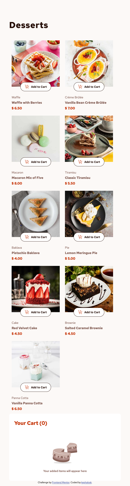

# Frontend Mentor - Social links profile solution

This is a solution to the [Blog preview card challenge on Frontend Mentor](https://www.frontendmentor.io/challenges/blog-preview-card-ckPaj01IcS/hub). Frontend Mentor challenges help you improve your coding skills by building realistic projects. 

## Table of contents

- [Overview](#overview)
  - [Screenshot](#screenshot)
  - [Links](#links)
- [My process](#my-process)
  - [Built with](#built-with)
  - [What I learned](#what-i-learned)
  - [Continued development](#continued-development)
  - [Useful resources](#useful-resources)
- [Author](#author)
- [Acknowledgments](#acknowledgments)


## Overview

### Screenshot

Desktop empty


Desktop selected


Desktop confirm


Tablet


Mobile empty


Mobile selected


Mobile selected


Active1


Active2


Active3


Active4


### Links

- Solution URL: [Add solution URL here](https://github.com/kephalosk/product-list-with-cart)
- Live Site URL: [Add live site URL here](https://kephalosk.github.io/product-list-with-cart/)

## My process

1. download Project


2. move Project to target folder


3. open Project in IDE


4. read README


5. add .gitignore-file


6. check files


7. check design


8. initialize repo
* create repo on GitHub
* git init
* git add .
* git commit -m "initial commit"
* git remote add origin git@github.com:kephalosk/${projectname}.git
* git push -u origin master

9. check html
* build general structure
* open index.html in browser for comparison

10. check css
* image styling
* font styling
* color styling
* frame styling
* spacing styling

11. check transitions


12. check javascript


13. check mobile/responsive design


14. check accessability
* semantic html
* headings
* alternative texts
* language
* clear language
* link texts

15. extract css


16. add screenshots


17. update README


18. publish website

### Built with

- Semantic HTML5 markup
- CSS custom properties
- Desktop-first workflow

### What I learned

I learned to use a http-server because CORS denies crossorigin reading in the filesystem.

I learned to extract reused html-content in extern components and include them via javascript.
```html
<button class="dessertButton">
  
    Add to Cart
</button>
```

I learned to put css-files next to the html-files they influence

I learned to work with asyncron functions that work with promises like the fetch-function.

I learned to use the module system in javascript
```javascript
import { loadComponents } from "./functions/loadComponents.js";
import {
    addButtonEventListener,
    addConfirmButtonEventListener,
    addRemoveButtonEventListener,
    addStartButtonEventListener
} from "./functions/addButtonEventListener.js";

document.addEventListener('DOMContentLoaded', async () => {
    await loadComponents();
    addButtonEventListener();
    addRemoveButtonEventListener();
    addConfirmButtonEventListener();
    addStartButtonEventListener();
});
```

I learned to work with variableFonts
```css
@font-face {
    font-family: 'Red Hat Text';
    src: url('assets/fonts/RedHatText-VariableFont_wght.ttf') format('truetype');
    font-weight: 400 700;
    font-style: normal;
}
```

I learned to organize big structures in different files and capsule them in themed folders.

I improved html, css and javascript skills in general.

### Continued development

* improve html
* improve css

### Useful resources

- [w3schools](https://www.w3schools.com/) - HTML and CSS knowledge
- [selfhtml](https://wiki.selfhtml.org/wiki/HTML) - HTML knowledge

## Author

- Website - [kephalosk](https://easywebpath.com)
- Frontend Mentor - [@yourusername](https://www.frontendmentor.io/profile/yourusername)
- Twitter - [@yourusername](https://www.twitter.com/yourusername)

## Acknowledgments

None.